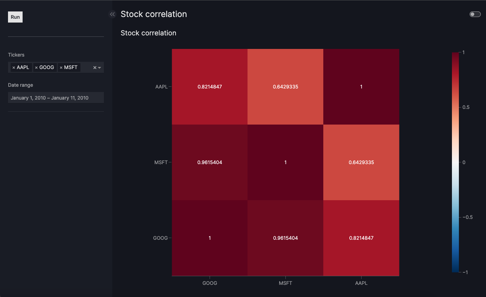

# README

A simple app to explore stock correlation.



## Usage

### Web service

The app is hosted [here](https://correlator-912593205481.us-west1.run.app/).

### Locally

Alternatively, you can run the app locally. Nb: see the [installation section](#installation) for installation guidelines.

=== python

    ```bash
    python src/ui/app.py
    ```

=== uvicorn

    ```bash
    uvicorn src.ui.app:server --bind 0.0.0.0:8080
    # use --reload flag for development
    ```

=== docker

    ```bash
    docker build -t correlator .
    docker run -p 8080:8080 correlator
    ```

## Development

### Installation

Clone the repository and install the dependencies.

```bash
git clone https://github.com/cverluise/stock_correlator.git
cd correlator
uv sync --all-extras --dev
```

### Continuous integration

Continuous integration is handled by github actions. It checks linting, test and docker image build. See [code_quality](.github/workflows/code_quality.yml) and [docker_build](.github/workflows/docker_build.yml).

In order to avoid painful CI iterations, we also recommend using the pre-defined pre-commit hooks. To install them, `pre-commit install`

### Stack

The stack is the following:

| Functionality         | Technology                                                                                                       |
| --------------------- | ---------------------------------------------------------------------------------------------------------------- |
| Dependency management | [uv](https://github.com/astral-sh/uv)                                                                            |
| Linting               | [ruff](https://astral.sh/ruff)                                                                                   |
| Tests                 | [pytest](https://docs.pytest.org/en/stable/)                                                                     |
| Front-end             | [Vizro](https://vizro.readthedocs.io/en/stable/)                                                                 |
| Containerization      | [Docker](https://www.docker.com/)                                                                                |
| CI/CD                 | [Github actions](https://github.com/features/actions)                                                            |
| Deployment            | GCP [Artifact registry](https://cloud.google.com/artifact-registry/docs) and [Run](https://cloud.google.com/run) |


### Ideas for improvement

Insights improvements:

- automated discovery of highly uncorrelated/correlated stocks
- rolling correlation analysis
- lead-lag tests (e.g. Granger causality)
- "portfolio" (optimization) and returns analysis
- [next level] embedding of stock returns for similarity analysis, etc

Technical improvements:

- add a REST API (e.g. with [FastAPI](https://fastapi.tiangolo.com/))
- extend ticker support

## Deployment

### Continuous deployment

Continuous deployment is handled by a github action [service_deployment](./.github/workflows/service_deployment.yml). When a new release is created, the action builds the docker image and deploys it to the prod instance. When the develop branch is updated, the action deploys the image to a dev environment.


### Manual deployment

The deployment relies on containerization (with docker) and google cloud Platform (GCP) for hosting the container.

!!! info "Env variables"

    ```bash
    GCP_PROJECT_ID=correlator-453922
    GCP_REGION=us-west1
    CR_NAMESPACE=correlator
    IMAGE_NAME=correlator
    TAG=latest
    SERVICE_NAME=correlator
    ```

### GCP authentication

```bash
gcloud auth configure-docker ${GCP_REGION}-docker.pkg.dev
```

### Create image and push to GCP

```bash
docker build -t ${IMAGE_NAME} .
docker tag ${IMAGE_NAME}:${TAG} ${GCP_REGION}-docker.pkg.dev/${GCP_PROJECT_ID}/${CR_NAMESPACE}/${IMAGE_NAME}:${TAG}
docker push ${GCP_REGION}-docker.pkg.dev/${GCP_PROJECT_ID}/${CR_NAMESPACE}/${IMAGE_NAME}:${TAG}
```

### Deploy to GCP

```bash
gcloud run deploy ${SERVICE_NAME} \
  --image ${GCP_REGION}-docker.pkg.dev/${GCP_PROJECT_ID}/${CR_NAMESPACE}/${IMAGE_NAME} \
  --platform managed \
  --region ${GCP_REGION} \
  --allow-unauthenticated \
  --port 8080 \
  --memory 2Gi \
  --cpu 4 \
  --min-instances 1
```
